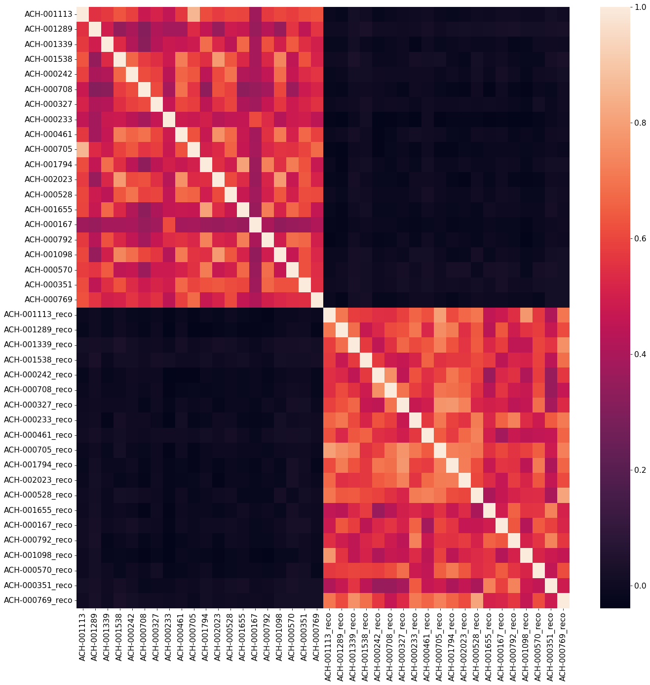

# explanation of the different notebooks

## Celligner2-trial

This notebook was the first run of NN models on expression data. I tried the TRVAE model with different params and got already impressive results.

Note: You will not be able to rerun this notebook without access to the depmap omics tracker and the taiga server (need to be part of CDS). However you can replace it with any gene level log2+1 transformed TPM expression from CCLE with the CCLE sample annotations.

## Celligner2-trial-2

trying out the first version with the added classifier and doing some further data preprocessing of the initial dataset (TPM with MET500, TCGA, CCLE, CCLF, HCMI from data/RNA_loading_human-v1.ipynb). In this version I initially get very good prediction (but I am looking at the full dataset (both training + validation). I need to look at validation only. or even keep a subset on the side to better confirm results.

Next I use the classifier's results to get at feature correlation (when using hundreds of features). I also get an early look at reconstruction (which was not that great initially) and look at how I can predict CCLE expression as if it was TCGA (counterfactuals). Trying to change the MMD location (Y1==first layet of decoder, instead of Z. which is the location given by TRVAE. this actually completely change what MMD is doing it seems.) and saw that the latent space was not great.

Trying it again with a larger model, I achieved a better reconstruction and bit better mixing.

I then tried again with MMD on Z and classification and good mixing of the lineages for each batch. I got really good mixing results. I could also see the importance of defining a good set of variable genes on which to do the analysis and using a large set of genes. __This to me is key to also understand the issue to celligner1 and points to a real need for using the full genome --> GCN__.

## Celligner2-trial-2-classification-and-vis

In this version, I am redoing a lot of the same analysis that was done in the previous one. 1. With a couple more viz and plots. we can see that changing some visual parameters (dot size/color) can make the plot look really nice (bias here!) and this was done with no cell line classification.

## Celligner2-manypredictions

In this version I wanted to see how far I could push the classification and batch definition by using many. Again most of the results made sense and the errors were on classes difficult to tell appart like or hard to guess. However looking at the latent space, only a blob emerged and similar poor reconstruction was achieved.  

## Celligner2-trial2-no-classification

In this version I tried the same model without adding any predictions (similar to the model used in Celligner2-trial.ipynb but done with the addition of CCLF). The resulting latent space plot was not a clear and this is likely due to CCLF samples containing both tumors and cell lines.

then I used the trained model and added directly the PDX and met500 samples. Some of them aligned well by default. which was quite encouraging.

I then did a CCLE/TCGA alignment with MMD on Y1 and no data for CCLE classification again. The results were not as good but we could very clearly see the EMT cluster in this one. __I did not get to why that happened__. I looked at the classification which was quite poor here. might be better with mmd on z.

I then looked at the latent space to check how I could interrogate it and was able to look at different latent dimensions and how they related to tumors and cell line features.

I was able to see really good reconstruction and counterfactual reconstruction. Also I see two plots of the confusion matrix for the no classification on CCLE and I am not able to know which one is the right one but the second one seems much better.

I then looked into the log transformation of the tpm data. not sure how it was transformed and its impact on the reconstruction. lookin more at the loss it seems that __it is recommended to use count data for most ML on RNAseq applications.__ (see Celligner2-trial3 for new version of the dataset)

## Celligner2-trial2-EMT-cluster

For this analysis I took back the initial no classification alignment of TCGA/CCLE/CCLF from Celligner2-trial2-no-classification.ipynb. I then clustered its latent space and look at the two clusters looking EMT like (by having loads of different lineages from CCLE).

I then looked at the distribution of known lineage dependency from lineage in the cluster vs out of the clusters, a similar analysis than Allie did (see Asana old tasks). We see much fewer samples than in Allie's initial plots as a lot of those have now already been re-classified as fibroblasts.

## Celligner2-trial2-LRP-explanableML

In this analysis we are using the new dataset made in data/RNA_loading_human-v1.ipynb. I did a first regular alignment on TCGA/CCLE looking only at explaining prediction for CCLExlineage I saw interesting and often good pathways/gene sets being expressed and some that were weird. I would later find out that this can be explained in part by the fact that these are CCLE lines. doing the same on TCGA and GTEX lead to much better results. Meaning __the weird gene sets being shows here might actually have some coarse biological meaning__.  

## Celligner2-trial3

In this analysis, continuing on the new dataset. We run a regular TCGA/CCLE alignment and the do the default architectural surgery from the Theis lab (which is without changing the weights of the hidden layers).

I then look at classification which looked poor or lineage but confusion matrix actually showed good results and errors that made sense.

The latent space also looked nice and again, different visualization led to bias in estimating the quality of the alignment. Overall it was indicating that architectural surgery is a meaningful way to add new datasets with novel batch effects.

The last part of the analysis is regarding the integration of ideas from the expimap model. The expimap model makes the latent space represent gene sets and the decoder being a linear model masked by the gene sets. But it is also a way to extend the latent space by adding novel gene sets or unbiased gene sets (where the linear models are unmasked) and increase the size of the decoder/encoder 's hidden layer. I first reimplemented that second part in order to potentially improve the architectural surgery of CL2. This worked and you can see the resulting alignement from an architectural surgery going from a 256-128 model to a 512-256 model. I haven't yet finished implementing the "geneset latent space" module.

## Celligner2-trial4

For this last analysis I used the latest dataset version. produced in data/RNA_loading_human-v2.ipynb in this one I included GTEX sample as well. I increased the gene input to 5000, increased model size to  hidden_layer_sizes = [820, 512, 256], latent_dim = 26 and changed some other training params. The output of that showed a great result that CCLE lines were aligning to TCGA but GTEX was not, although it was getting close. This seemed like a good result!

Adding additional datasets (HCMI/CCLF) showed again that CCLF can be realigned pretty well without retraining but that HCMI cannot. we have a look at breast metastasis that show a clearly different signal (as shown un the umap but also discovered by just showing a dimensionality reduction scatter plot of the transcriptome of breast samples)

prediction on CCLE lineage was even higher than other examples and we could see an improved alignment to CCLF lineage (all this while not even training on this alignment!) __Looking at how this changes if one was to train on alignment (without doing classification) would be very interesting.__

I then looked at the LRP explanation of the lung classification and found that thanks to GTEX the pathway qualities were really good! with low pvalues and everything making sense:

- DESCARTES_MAIN_FETAL_BRONCHIOLAR_AND_ALVEOLAR_EPITHELIAL_CELLS
- TRAVAGLINI_LUNG_SIGNALING_ALVEOLAR_EPITHELIAL_TYPE_2_CELL
- DESCARTES_FETAL_HEART_ELF3_AGBL2_POSITIVE_CELLS
- ZHONG_PFC_C2_UNKNOWN_NPC
- DESCARTES_FETAL_STOMACH_MYELOID_CELLS
- DURANTE_ADULT_OLFACTORY_NEUROEPITHELIUM_RESPIRATORY_COLUMNAR_CELLS
- DESCARTES_MAIN_FETAL_ANTIGEN_PRESENTING_CELLS
- DURANTE_ADULT_OLFACTORY_NEUROEPITHELIUM_RESPIRATORY_HORIZONTAL_BASAL_CELLS
- DURANTE_ADULT_OLFACTORY_NEUROEPITHELIUM_MONOCYTES
- FAN_EMBRYONIC_CTX_MICROGLIA_1
- TRAVAGLINI_LUNG_PROLIFERATING_NK_T_CELL
- DURANTE_ADULT_OLFACTORY_NEUROEPITHELIUM_MACROPHAGES
- DESCARTES_FETAL_PLACENTA_MYELOID_CELLS
- DESCARTES_FETAL_LUNG_BRONCHIOLAR_AND_ALVEOLAR_EPITHELIAL_CELLS
- TRAVAGLINI_LUNG_MYELOID_DENDRITIC_TYPE_1_CELL
- HALLMARK_INTERFERON_GAMMA_RESPONSE
- TRAVAGLINI_LUNG_IGSF21_DENDRITIC_CELL
- TRAVAGLINI_LUNG_CAPILLARY_AEROCYTE_CELL
- HALLMARK_MYC_TARGETS_V2
- DESCARTES_FETAL_ADRENAL_MYELOID_CELLS

Some like HALLMARK_MYC_TARGETS_V2, FETAL_LUNG, PFC_C2, FETAL_ANTIGEN_PRESENTING, FETAL_MYELOIDS clearly point to the TCGA and CCLE samples as they represent related lung cancer pathways. Other pathways were found too such as:
- DURANTE_ADULT_OLFACTORY_NEUROEPITHELIUM_RESPIR....
- 4TRAVAGLINI_LUNG_IGSF21_DENDRITIC_CELLS
- DESCARTES_MAIN_FETAL_BRONCHIOLAR_AND_ALVEOLAR_
- BUSSLINGER_ESOPHAGEAL_PROLIFERATING_BASAL_CELLS
- TRAVAGLINI_LUNG_PROLIFERATING_NK_T_CELLS
- DESCARTES_FETAL_LUNG_BRONCHIOLAR_AND_ALVEOLAR_...
- DURANTE_ADULT_OLFACTORY_NEUROEPITHELIUM_SUSTEN...
- BUSSLINGER_ESOPHAGEAL_EARLY_SUPRABASAL_CELLS
- HALLMARK_E2F_TARGETS
- DESCARTES_FETAL_STOMACH_SQUAMOUS_EPITHELIAL_CELLS
- HALLMARK_INTERFERON_ALPHA_RESPONSE
- TRAVAGLINI_LUNG_DIFFERENTIATING_BASAL_CELLS
- HALLMARK_MYC_TARGETS_V1
- DESCARTES_FETAL_EYE_CORNEAL_AND_CONJUNCTIVAL_E..
- DESCARTES_FETAL_KIDNEY_URETERIC_BUD_CELLS
- BUSSLINGER_ESOPHAGEAL_QUIESCENT_BASAL_CELLS
- BUSSLINGER_GASTRIC_IMMATURE_PIT_CELLS
- TRAVAGLINI_LUNG_GOBLET_CELLS

with E2F, targets also known to be relevant in cancer (some links in the main CL2 presentation).

I then looked at the LRP explanation of CCLE specific lung classifications on gsea and found still pathways related to lung, lung cancer, but also many pathways which do not seem to have a good direct explanation. Here it might be interesting to look at ssGSEA of CCLE's lung samples vs TCGA's?

Additionally I quickly checked reconstruction and counterfactual reconstruction and saw also even better agreement than in previous reconstructions (we have 5000 genes instead of 3k)(not shown in the notebook but looked at average corelation between groups compared to previous notebooks).

I Finally looked at the latent space of this trio of dataset when no classification was applied. Interestingly, playing with model size I could see that the latent space was not the same when the model was large, especially regarding the EMT signal. Another latent space change could be seen from increasing the latent space dimension. (first plot is with larger net and second is with smaller net).

## Next steps

A lot of the old analysis would gain from being reproduced with the latest dataset versions. additionally many still have open questions.

What is the true impact of gene selection? what is the training/testing ratio's impact? can we understand better the gene sets and LRP? how can we best fine tune the model for different needs? how would CCLE normal samples align (with gtex?)? Do we see diff expressed genes between CCLE/TCGA-like reconstructions or TCGA/GTEX's? can we use a better loss model for the reconstruction(given we are using bulk RNAseq)? and many other smaller questions are still left unexplored.

Other bigger questions such as finishing the model with GNN layers, adding the adversarial classifier, adding the expimap mode, using deeper residual blocks, performing deseq analysis, would be great to look into.

Moreover extending the model to scRNAseq data as well as PERTURBseq (and even combinatorial analysis) would be a tremendously interesting research project.
